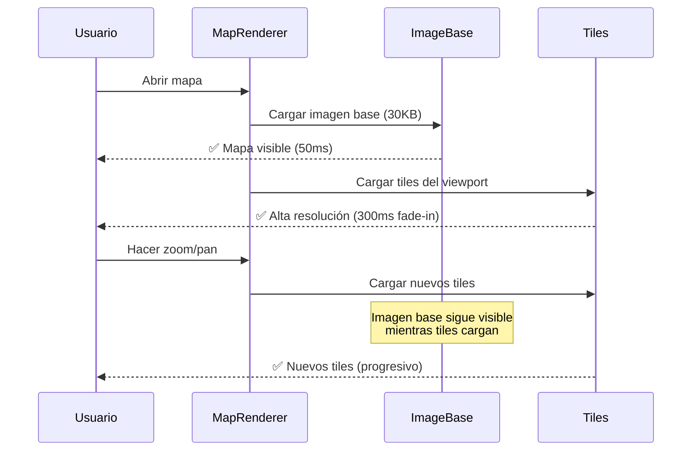

# ⚡ Quick Start: Tiles de Alta Resolución

## 🎯 Resumen de la Implementación

Se ha implementado un **sistema de 2 capas** para mapas de alta resolución:

1. **Capa Base (30KB)** → Imagen de baja resolución, siempre visible
2. **Capa Tiles** → Tiles de alta resolución que cargan progresivamente

**Resultado:** El usuario **siempre ve un mapa**, incluso con internet lento.

---

## 🚀 Pasos para Implementar

### 1️⃣ Instalar GDAL

**Windows:**

```powershell
# Descargar desde: https://www.gisinternals.com/release.php
# Buscar: "GDAL-X.X.X-win64.msi"
# Instalar y agregar a PATH
```

**Verificar:**

```powershell
gdal2tiles.py --version
```

---

### 2️⃣ Preparar Imagen

**Necesitas:**

- `encuadres.tif` (GeoTIFF con georreferenciación)
- `encuadres.pgw` (World file con coordenadas)
- `encuadres-base.webp` (Imagen base de 30KB)

**Ubicación:**

```
public/assets/maps/base-images/chapter1/
├── encuadres.tif
├── encuadres.pgw
└── encuadres-base.webp
```

---

### 3️⃣ Generar Tiles

```powershell
# Desde la raíz del proyecto
.\scripts\generate-tiles.ps1 -MapName "encuadres" -MaxZoom 18
```

**Esto creará:**

```
public/assets/maps/tiles/encuadres/
├── 0/0/0.png
├── 1/0/0.png
├── 1/0/1.png
├── ... (~50,000 tiles para zoom 0-18)
```

⏱️ **Tiempo:** ~10-15 minutos (depende del CPU)

---

### 4️⃣ Configurar Mapa

**Ya está configurado en `mapSettings.ts`:**

```typescript
"chapter1-encuadres": {
  // ... configuración existente ...

  // ✅ Tiles habilitados
  useTiles: true,
  tilesConfig: {
    urlTemplate: "/assets/maps/tiles/encuadres/{z}/{x}/{y}.png",
    tileSize: 512,
    minZoom: 0,
    maxZoom: 18,
    fadeInDuration: 300,
  },
}
```

---

### 5️⃣ Probar

```powershell
# Iniciar dev server
npm run dev

# Abrir en navegador
http://localhost:5173
```

**Verificar:**

- ✅ Imagen base se ve inmediatamente
- ✅ Tiles de alta resolución cargan al hacer zoom
- ✅ No hay espacios negros al hacer zoom
- ✅ Transición suave (fade-in)

---

## 🎨 Arquitectura de Capas

```
┌─────────────────────────────────────┐
│  Capa 2: Tiles Alta Resolución     │
│  • Carga progresiva                  │
│  • Solo visible donde el usuario mira│
│  • 512x512 px por tile               │
└─────────────────────────────────────┘
             ↑ Superpuesta
┌─────────────────────────────────────┐
│  Capa 1: Imagen Base (30KB)        │
│  • Carga instantánea                 │
│  • Siempre visible                   │
│  • Fallback si tiles fallan          │
└─────────────────────────────────────┘
```

---

## 📊 Flujo de Carga



---

## 🔧 Ajustes Opcionales

### Cambiar Zoom Máximo

```typescript
tilesConfig: {
  maxZoom: 16, // En lugar de 18 (menos tiles, más rápido)
}
```

### Cambiar TileSize

```typescript
tilesConfig: {
  tileSize: 256, // En lugar de 512 (más tiles, menos por request)
}
```

### Cambiar Algoritmo de Resampling

```powershell
# Más calidad (más lento)
.\scripts\generate-tiles.ps1 -MapName "encuadres" -Resampling "lanczos"

# Más rápido (menos calidad)
.\scripts\generate-tiles.ps1 -MapName "encuadres" -Resampling "bilinear"
```

---

## 📦 Agregar Nuevo Mapa con Tiles

### 1. Preparar archivos

```
public/assets/maps/base-images/chapter2/
├── valle.tif
├── valle.pgw
└── valle-base.webp
```

### 2. Generar tiles

```powershell
.\scripts\generate-tiles.ps1 -MapName "valle" -MaxZoom 18
```

### 3. Configurar en mapSettings.ts

```typescript
"chapter2-valle": {
  // ... configuración base ...

  useTiles: true,
  tilesConfig: {
    urlTemplate: "/assets/maps/tiles/valle/{z}/{x}/{y}.png",
    tileSize: 512,
    minZoom: 0,
    maxZoom: 18,
    fadeInDuration: 300,
  },
}
```

### 4. Done! 🎉

El MapRenderer automáticamente:

- ✅ Carga la imagen base
- ✅ Agrega la capa de tiles
- ✅ Aplica transformaciones (flip/rotate)
- ✅ Configura bounds correctamente

---

## 🐛 Debug

### Ver requests de tiles

1. Abrir **DevTools** → **Network**
2. Filtrar por `tiles/`
3. Ver qué tiles se están cargando

### Ver bordes de tiles

```javascript
// En console del navegador
map.showTileBoundaries = true;
```

### Inspeccionar source

```javascript
const source = map.getSource("chapter1-encuadres-tiles");
console.log(source);
```

---

## 📚 Documentación Completa

- [📖 Guía de Generación de Tiles](./TILES_GENERATION_GUIDE.md)
- [🚀 Configuración de Servidor](./TILES_SERVER_SETUP.md)

---

## ✅ Checklist

- [ ] GDAL instalado
- [ ] Imagen `.tif` preparada con `.pgw`
- [ ] Imagen base `.webp` (30KB) lista
- [ ] Tiles generados con script
- [ ] Tile 0/0/0.png accesible en navegador
- [ ] MapSettings configurado
- [ ] Mapa carga correctamente
- [ ] Tiles se ven al hacer zoom
- [ ] Fallback a imagen base funciona

---

**¿Listo para empezar?** 🚀

```powershell
# 1. Instalar GDAL (si no lo tienes)
# 2. Generar tiles
.\scripts\generate-tiles.ps1 -MapName "encuadres" -MaxZoom 18

# 3. Iniciar servidor
npm run dev

# 4. ¡Probar!
```
